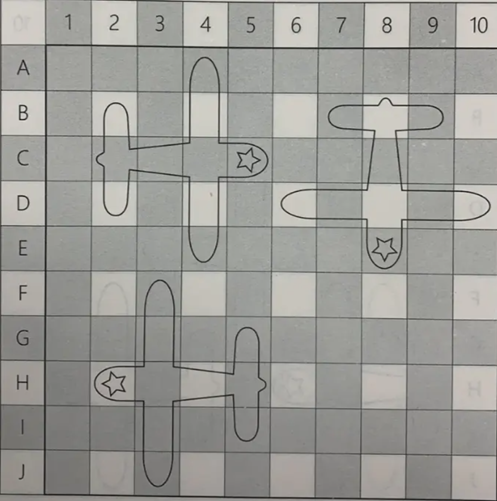
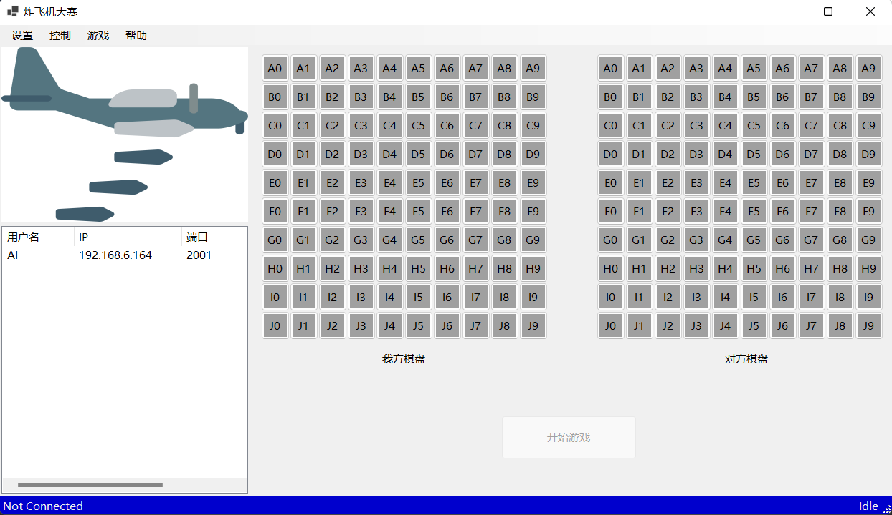
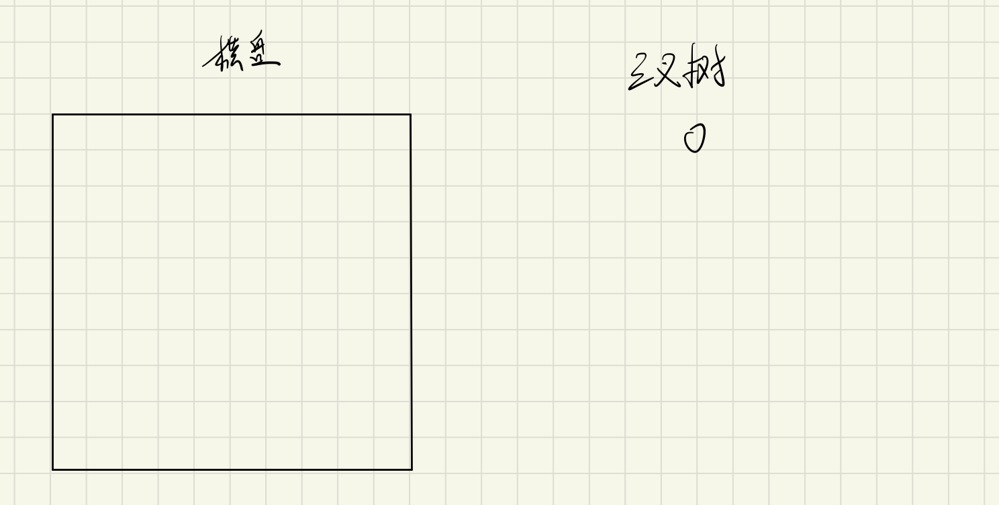
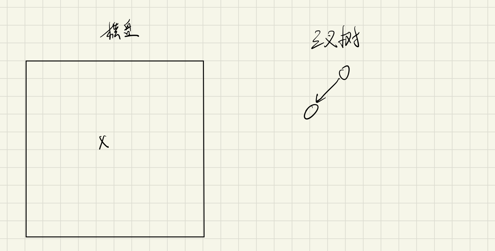
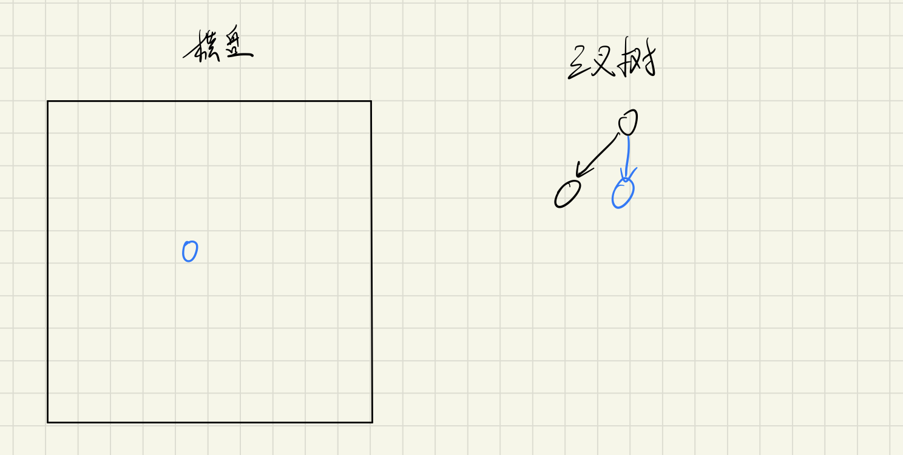
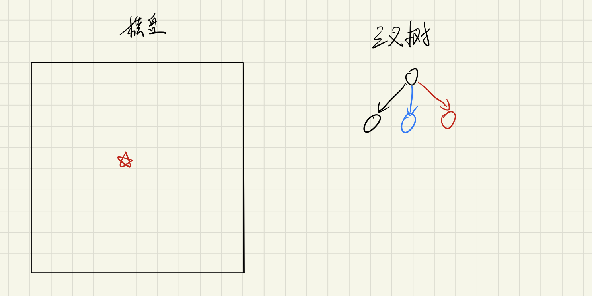
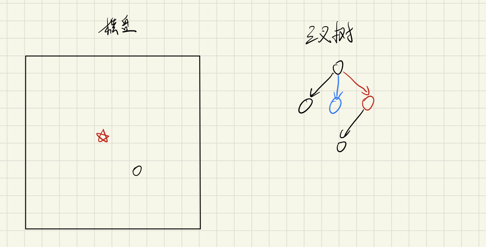
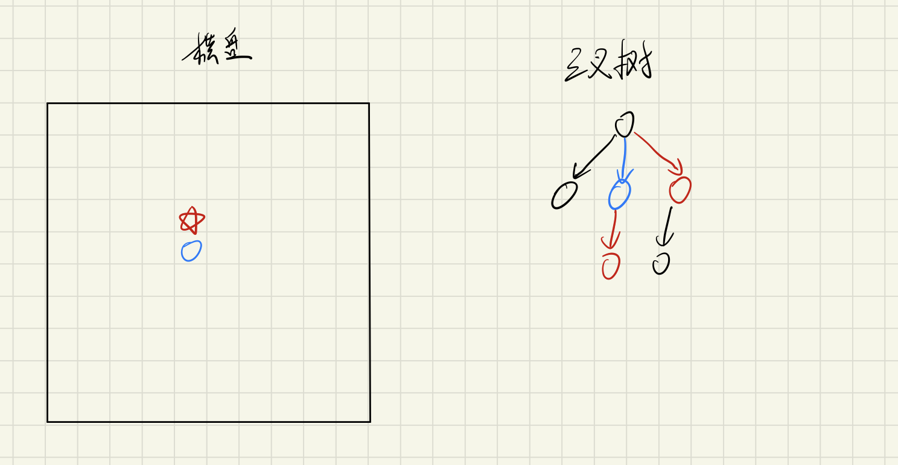
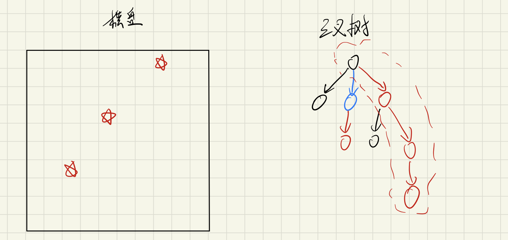

# 纸上飞机大战

本项目基于 _.NET6_ 和 _C#_ 实现了纸上飞机大战游戏（也称炸飞机or打飞机🤦）。

本项目实现了如下的一些功能：
- 成功实现了**网络对战**；
- 成功实现了**辅助猜想**对方飞机位置；
- 实现了**AI自动对战**并给出了相应**策略分析**⭐。

## 摘要

两个人，在纸上画10*10的格子，然后各自在格子上画三个飞机形状，飞机的结构是1513：
飞机头1个格、机翅5个格、机翅机尾连接1个格，机尾3个格，可以调整方向。

一般都是准备两个10×10的方格，一个画自己的飞机，一个留着打对方飞机时用。画好后，双方喊坐标。

例如对方喊3-5，就是指纵向第三行，横向第五格，那个位置，如果正好打到飞机机身了，就叫“中”或叫“伤”，
打不到叫“空”，如果打到机头叫“死”，
但是有些飞机即使死了也可以迷惑对方一会，如果三架飞机都打死了，就算胜利。

## 介绍

游戏界面由控制栏、状态栏、连接列表框，我方棋盘和对方棋盘及主按钮构成，如下：

可以在控制栏中的**帮助**寻找相关说明。

### 基本游戏流程
1. 首先选择左侧列表中的任一用户右键后点击“连接”，一般都会存在运行在本机上的AI程序。
2. 点击主按钮开始游戏，向对方发送游戏请求，若对方接受则可以开始游戏。
2. 使用鼠标点击某一架飞机后，使用键盘上的*w*、*s*、*a*、*d*键来控制飞机上下左右移动，使用*r*键来控制飞机旋转。
3. 双方都完成飞机位置调整后即可正式开始游戏。
3. 游戏状态下，双方选择在敌方棋盘上选择相应位置后点击轰炸即可完成选择轰炸。
6. 任意方飞机全部被找出后结束游戏，并提示游戏结果。

### 控制栏
控制栏既游戏上方的栏目，包含“包含”、“控制”、“游戏”和“帮助”，提供对游戏的一些设置及控制，详情可见其中的**帮助**提供的说明。

### 状态栏
状态栏既游戏下方蓝色的栏目，显示相关状态。

其中左侧显示此时的连接状态，是否与某个游戏程序建立了连接。

右侧显示游戏状态，包括是否在游戏中或对方是否完成相应操作等等。

### 连接列表框

连接列表框提供与其他游戏程序连接的功能，单击右键可以尝试连接或者刷新。

其中**刷新**会扫描某个网段上某个端口是否存在游戏程序在监听，因此游戏的网络堆栈实际上基于P2P方式，而不是基于服务器和客户端方式实现的。

### 游戏主界面

游戏主界面主要包括我方棋盘和对方棋盘及主按钮。

游戏的主要操作基本包括使用键盘进行飞机控制和使用鼠标进行选择和轰炸等。

## 需求规格说明

本项目需要C#完成网络程序开发，实现纸上飞机大战游戏，并且需要完成以下功能。

### 网络对战

游戏程序之间应该能够经由Socket套接字建立连接，并进行相互的对战。

游戏程序应能够通过某种方式查询到彼此并尝试连接。

对战过程中应实现实时的状态同步，保证双方的操作秩序，并实现完整的游戏流程。

### 游戏辅助猜想

在游戏的选择轰炸过程中，应能够提供一定的视觉辅助，以帮助玩家判断当前棋盘局势以及对方可能的飞机摆放方式。

若有可能，也可由游戏来分析提供辅助轰炸位置选择。

### AI自动对战

玩家也可以与AI进行对战，AI应能自行摆放飞机并且猜测玩家飞机位置。

AI应该具有一定的智能，按照优化过的策略进行飞机位置的猜测及轰炸位置的选择。

### 模型对战接口

程序应指定给模型代理游戏的接口，以实现不同游戏策略模型之间相互对战的验证。

## 设计和实现

针对某一项需求，本项目做出了针对性的实现。

### 网络对战

游戏的网络连接方式采用P2P的方式，每一个游戏程序既是服务端，也是客户端，彼此之间通过Socket套接字建立连接。

游戏程序后台会运行一个监听程序，也可认为是服务端程序，其监听某个端口上是否由其他游戏程序的连接请求。

玩家可以通过**刷新**功能来搜索某一网段上某些端口是否存在游戏程序正在监听。

**刷新**功能的具体实现方式是通过Ping命令返回的包判断某个网段上是否存在可以连接到的主机，在通过Socket套结字尝试连接某些端口，以判断这些端口上是否有其他游戏程序在监听。

在发起**连接**请求后，两个游戏程序之间可能会进行口令的验证，验证通过之后即可完成连接，并准备开始游戏。

游戏期间，游戏程序之间通过Socket相互传递数据并同步彼此游戏状态。

### 游戏辅助猜想

游戏辅助猜想通过在地方棋盘上摆放三个玩家可以控制移动的飞机实现，其操作方式和飞机摆放的准备阶段是一样的。

### AI自动对战

AI程序的分析详见以下的分析部分。

### 模型对战接口

游戏程序给模型对战提供了接口，也即**托管**。

模型应被编译成可执行的文件，并通过参数来传入游戏的状态并控制程序的行为及返回的结果，游戏程序再通过模型返回的结果继续游戏的运行。

Tip:通过参数来传递包括棋盘状态等应该是完全足够的，详细的再看完下面的分析应该不难理解。

## 分析⭐

本节主要对该游戏的AI程序设计做分析，并给出如下结论:
- **任何确定性炸飞机的AI游戏策略都与一颗建立在飞机摆放位置状态空间上的决策树意义一一对应**。
- **存在基于某种标准的确定性最优轰炸策略，该问题与等价于搜索经验风险为0同时结构风险最小的最优决策树，该问题为NP完全问题。**
- **对于确定性策略乃至随机化策略的验证更应该基于策略在飞机摆放状态集上的期望损失来度量。**
- **任何一种确定性策略，都存在一种飞机摆放位置，使得它至少需要10步才能完全判断它是如何摆方的，而对于任何一种随机化策略，则期望上至少需要10步。**

### 轰炸策略or决策树？

炸飞机游戏AI程序的优化目标直观的说就是尽可以快的找到对方摆放的所有飞机的位置。
因际上AI程序的设计完全不需要考虑对方猜测我方棋盘的情况（当然如果要基于此情况来制定不同的策略另外当别论，但理论上是不需要的），因而实际上该问题和设计扫雷程序的AI是十分类似的。

虽然炸飞机AI设计的相关研究几乎没有（估计这游戏比较冷门吧），但扫雷游戏的AI的相关研究还是有的，但这边的分析还是出于一个相对不同的角度。

#### 形式化说明

考虑所有可能的飞机摆放位置构成的集合 $A$ ，该集合在棋盘大小为 $10×10$ 的时候并不特别大，通过简单的DFS算法即可搜索其大小，这边给出结论，共有 $66816$ 种摆放方式[1](https://zhuanlan.zhihu.com/p/423834026)。

所有的炸飞机游戏AI程序设计都可以被认为是指定一个策略 $T$ ，该策略将当前棋盘状态 $s$ 作为输入，输出一个选择的轰炸位置 $[x,y]$ ,如下：

$$T(s) = [x,y]$$

若将 $[x,y]$ 变为 $[X,Y]$ ，既输出是随机变量，则将这种策略称为随机化策略，此时 $R$ 是一个泛函。相反，若输出是一个确定的向量， $R$ 是一个函数，则将该种策略称为确定性策略。
这边主要考虑确定性策略，对于随机化策略也会一些简单的说明。

定义一个结果函数 $R$ ，该函数给出在某种飞机摆放情况下，选择轰炸某个坐标点时会给出的结果:

$$R(a,[x,y])\in G -\{h,b,n\}$$

其中 $G$ 表示所有的结果构成的集合， $h,b,n$ 分别表示命中飞机头、飞机身体和什么都没命中，而 $a$ 属于集合 $A$ 表示某一种特定的飞机摆放方式。

AI程序运行的全过程就是在每一个策略 $R$ 基于当前状态选择一个位置 $[x,y]$ ，基于该位置可能会飞机头、飞机身体和什么都没命中三种结果，因而得到新的棋盘状态，再基于该棋盘状态重新选择，知道找到所有的飞机。因而不难发现，任何一个AI程序所有运行的可能情况实际上构成了一颗三叉树，以下给出一个**实例**说明这一点。

#### 实例
该实例中策略 $T$ 具体是什么并不重要，实际上它就是随便选的，主要是为了说明问题。

首先初始状态如下：

当前策略选择某个位置，并且该位置为空：

当前策略选择的位置为机身：

当前策略选择的位置为机头：

在第一步为机头的前提下选择了某个位置，并且为空：

在第一个为机身的情况下选择了某个位置，并且为机头（**选择的位置和前一个图不一样！**）:

某个极其幸运的情况，三步都点到了机头：

不难发现，实际上任何一种确定性策略 $R$ 都可以基于上述的方式展开成一颗三叉树。

#### 三叉树分析

首先分析这颗三叉树中的叶子节点，也即这颗三叉树应该展开到什么程度。为了理论分析的方便，我们要求这颗三叉树展开到唯一确定飞机摆放的状态，而不是找到了三个飞机头就停下来。这实际上不会有大影响，因为在绝大多数情况下，最后的叶子节点都已经一一对应了一个棋盘状态，即使是实例中的最后一张图，对应的情况也仅仅是飞机旋转的不同可能。

在基于完全展开的前提下，可以显然发现三叉树中任意一条路径都唯一对应了一种飞机摆放情况，也即这颗三叉树的叶子个数一定等于棋盘摆放个数，等于 $66816$。

另一方面，熟悉机器学习领域中决策树算法的人或许会意识到，这颗**三叉树本质上就是一颗决策树**，而基于某种策略 $R$ 的AI程序的运行过程完全等价于在一颗构建好的决策树上逐步向下的搜索过程。这一直觉，将为接下来制定AI算法提供巨大的帮助。

### 最优策略？可望而不可及

一些熟悉信息论的人或许还会发现，实际上每一条路径还对应了唯一的一种对棋盘摆放状态的编码，而编码中的每一位就是"头身空"三种状态之一，因而猜测是否存在某种类似哈夫曼编码的方式能够将所有的飞机摆放位置的状态空间按最优的方式编码起来。

然而不幸的是，这里要给出这样一个结论，**不论在任何意义上的最优，都不存在简单的方式将这种编码方式找出来或是验证它**。这里的“不存在简单的方式”指的是这样的搜索问题是一个NP完全问题，因而这就给了AI算法设计以充足的空间，毕竟任何人在说自己的算法是最好的时候，你可以诘问他：“我不信，请证明我给看”。

我们给出这个结论的也是基于前述**三叉树是一颗决策树**的直觉。我们考虑任何一种棋盘摆放情况 $a$ ，它都唯一对应了一个矩阵 $g \in G^{10\times 10}$ 。游戏策略 $T$ 对应的决策树 $D$ 实际上是一个 $G^{10\times 10} \rightarrow A$ 上的函数，并且决策树 $D$ 的经验风险为0，也即我们总能通过它分类正确的飞机摆放状态。而任何意义上的最优实际上都对应了该决策树的结构风险，这边基于该游戏给出一个形式上的结构风险：

$$J(D) = \sum_A L(a)p(a) $$

其中 $L(a)$ 表示该棋盘摆放情况 $a$ 在决策树上对应的路径长度， $p(a)$ 表示该棋盘摆放情况的可能性，在没有先验的情况下可以认为分布是均匀的，每种摆放发生的可能性是相同的，但在实际上更加紧密的飞机摆放可能概率更高。直观上，这个公式的意思就是在多少步内能够结束游戏的期望值。

这边直接引用李航老师《统计机器学习》中的结论：
>在损失函数确定以后，学习问题就变为在损失函数意义下选择最优决策树的问题。因为从所有可能的决策树中选取最优决策树是NP完全问题，所以现实中决策树学习算法通常采用启发式方法，近似求解这一最优化问题。这样得到的决策树是次最优的。

因而，实际上搜索一个最优的炸飞机游戏策略，也是一个NP完全问题，既不仅找到这个最优策略是NP难的，验证方案是最优也是NP难的。虽然这是一个令人的沮丧的结论，但是我们还是可以得到以下两个重要的事实:
- **即使不进行模型之间的对战，也完全可以完成模型的验证和彼此策略的优劣比较，只需要计算对应决策树的结构损失即可。**
- **决策树模型中的经典算法的设计思路可以迁移到AI策略的设计上。**

#### 次优策略：*DECESION TREE IS ALL YOU NEED*

[用C++写一个《炸飞机》/《死亡轰炸》游戏辅助程序](https://zhuanlan.zhihu.com/p/423834026)中提到了一种策略的指定方式：
> 总体的思路是这样的：首先保存下所有的可能，然后每一步决定一个轰炸位置，这个轰炸位置由当前局面和可能集合共同决定，直到找到所有 planeHead 为止。因此最核心的就是每一步应该遵循怎样的策略？
> 
> 最贪心的想法就是，找到一个轰炸位置，使得选择它之后能够排除尽可能多的可能，也就是：
> 
> >找到一个期望收益最大的位置，这里的收益表示通过轰炸这个位置能够减少的可能数目
>
>每个轰炸位置只有三种情况，我们假设这个位置为 empty, plane 和 planeHead 的概率分别为 $p_1$ , $p_2$ 和 $p_3$ ，当前可能集合的大小为 $N$，那么选择这个位置进行轰炸的期望收益就是：
>$$E=p_1(p_2 N + p_3 N) + p_2(p_1 N + p_3 N) + p_3(p_1 N + p_2 N)$$
>而每个概率则可以通过枚举每一种可能来统计得出（注意每一个决策步骤中这三个概率是不一样的）。执行完每一步之后，通过真实的结果去更新当前局面和可能集合。最终可以非常快地找出所有机头。

这篇文章提出了一种非常符合直觉的启发式算法，也即每一步尽可能排除多的可能。但比起算法本身，更重要的意义是若经过几步简单的推导，就可以发现它和经典决策树算法的对应关系，并帮助我们建立游戏策略和决策树算法的内在联系。

首先我们对轰炸的期望收益进行一定的变换:

$$
\begin{align*}
	E&=p_1(p_2 N + p_3 N) + p_2(p_1 N + p_3 N) + p_3(p_1 N + p_2 N) \\
	&=2N(p_1 p_2 + p_2 p_3 + p_1 p_3)
\end{align*}
$$

对于不同的轰炸选择， $N$ 是一个常数，并且有

$$
p_1 + p_2 + p_3 = 1
$$

因而有

$$
\begin{align*}
	&\text{Maximize } \\
    \iff &\text{Maximize } 2N(p_1 p_2 + p_2 p_3 + p_1 p_3)\\
    \iff &\text{Maximize } 2p_1 p_2 + 2p_2 p_3 + 2p_1 p_3\\
    \iff &\text{Maximize } (p_1 + p_2 + p_3)^2 - p_1^2 - p_2^2 - p_3^2\\
    \iff &\text{Maximize } 1 - p_1^2 - p_2^2 - p_3^2\\
    \iff &\text{Maximize } \sum_{i=1}^3 p_i(1-p_i)\\
\end{align*}
$$

对于CART决策树熟悉的人就会发现 

$$\sum_{i=1}^3 p_i(1-p_i)$$

就是概率分布的基尼系数，它代表了从概率分布中任意抽取两个点，他们属于同一个类的概率。因而基于每一步尽可能排除多的可能的启发式策略，就等价于用数据集为各种飞机摆放情况采用CART算法训练得到一颗经验风险为0的决策树。

这一结果不仅解释了指定AI策略的直觉义，也给了经典了CART算法的成功提供了不同的解释角度。

传统决策树的经典算法还有ID3和C4.5，这里对ID3作进一步的分析

ID3决策树基于每个特征 $A$ 的信息增益来选择特征，训练集记作 $D$ 。由前面的分析可以认识到，所谓特征就对应了棋盘上所有点对应的可能结果，而训练集就是所有飞机摆放位置及其对应的棋盘状态。信息增益的公式如下：

$$
g(D,A) = H(D) - H(D|A)
$$

其中 $H(D)$ 表示数据集 $D$ 的信息熵， $H(D|A)$ 表示给定特征 $A$ 下数据集 $D$ 的条件熵，具体公式如下：

$$
H(X)=-\sum_{i=1}^{n}p_i \log{p_i}\\
H(Y|X)=-\sum_{i=1}^{n}p_i H(Y|X=x_i)
$$

实际上，若上式中 $\log$ 底取 $3$ ，同时在每一步中，对于不同的点 $H(D)$ 都相同，基于信息增益对应的AI策略算法可以做这样解释：

每一步选择一个点，这个点是剩下所有可选的所有点中，在假设接下来构建出的三叉树完全平衡的情况下，选择这个点后，构建出来的三叉树期望路径长度最短的那个。
也即，它是基于构建出的三叉树完全平衡这一假设的前提下，每一步都对前述形式化结构损失基于单步贪心策略做优化的结果。

但是总所周知，基于单步贪心策略并不一定能够得到最优解，这也是我们在认识到这个问题是NP难之后所预料到的，但是基于这一策略依旧能够得到相对好的解。

此外，对于这个策略的改进就是增大每一步的贪心预测的步骤，既由最开始一次选 $1$ 点外推到一次选 $n$ 个点，随后从 $C_{m}^n!$ 中可能性中选择最优的，其中 $m$ 表示当前剩下可选的位置。显然当 $n=100$ 是相当于完全展开三叉树选择最优的，此时可能性有 $100!$ 种。

### 最优下界？虽不可至，心向往之

由前文提到的一些内容，可以非常容易地得到期望损失的下界就是数据集的信息熵，很容易可以计算得到为 $\log_3(66816) = 10.11248278068232$ 。而信息熵实际上就等价于三叉树完全平衡的情况，因而基于容斥原理，我们就可以得到前文所提到的结论，任何一种策略都存在一种棋盘摆放方式至少需要 $\lfloor 10.11248278068232\rfloor$ 步才能完全探明。

对于随机化的策略，这里不加解释定性地给出结论，任何一种随机化策略在近似等价于不同的确定化策略的合并，既合并不同的三叉树，因而在期望意义上不可能突破信息熵给出的下界。

实际上，这里给出结论可能比真实的下界还要低很多，因为这颗任何三叉树从根到叶子节点上最多只能三个节点对应飞机头，因而这棵树实际上应该是非常不平衡的。

## 结论

本项目基本实现了相应的需求并就游戏策略给出了详尽的分析。

## 引用及授权许可

除特殊说明外，代码遵循 [MIT License](https://opensource.org/licenses/MIT)。

如果有任何问题，可以通过邮箱<rosenberg371@outlook.com>联系我。
